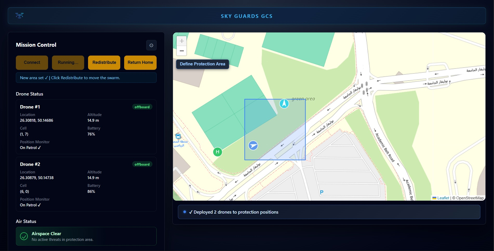

# Hi, I'm Kenan Kaddoura 👋
 
**Software engineer who builds with a product lens.**
Software Engineering graduate (KFUPM '26), currently building full-stack mobile at an early-stage startup. I like shipping things people actually use — and the messy product decisions that get them there.
 
🎯 Open to **Product Engineer** roles &nbsp;·&nbsp; 📍 Dammam, KSA / Remote
 

 
---
 
## 🚁 Sky Guards — Cooperative UAV Swarm for Drone Detection
 
> Senior project · **Project & Software Lead** · 6-engineer team
 
An autonomous two-drone swarm that patrols an area, detects hostile drones with onboard AI, and pinpoints their location — deployable by one person in **under 5 minutes**.
 
I led the team and built the full-stack **Ground Control Station (Python)** — the operator's command center — including a **Shared Probability Grid Map** that routes the swarm for maximum area coverage.
 

 
*The Ground Control Station I built — live swarm monitoring, protection-area definition, and one-click redistribution.* &nbsp; **▶️ [Watch the full demo](https://www.youtube.com/watch?v=5gTlGVEdDx0)**
 

<b>📊 See the full project poster</b>

 
[]
 

---
 
## 📱 Diet Loop
 
A food-subscription app I build and maintain as a Full-Stack Mobile Engineer — Flutter user app, Kotlin restaurant app, Node.js backend. Live on Google Play:
 

 
---
 
### 🛠️ Tech I work with
 
`Flutter` · `Dart` · `Kotlin` · `Node.js` · `Python` · `React` · `TypeScript` · `MongoDB`
 
---
 
💬 Open to **Product Engineer** roles and genuinely interesting problems — [reach out on LinkedIn](https://www.linkedin.com/in/kenan-kaddoura/).
