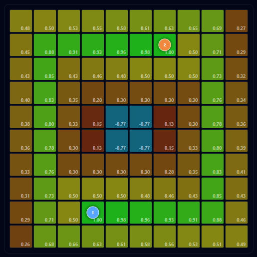

# Hi, I'm Kenan Kaddoura 👋
 
**Software Engineer who builds with a Product lens.**   

Software Engineering graduate (KFUPM '26), currently building full-stack mobile at an early-stage startup.    

I like shipping things people actually use — and the messy product decisions that get them there.
 
🎯 Open to **Product Engineer** roles &nbsp;·&nbsp; 📍 Dammam, KSA / Remote
 

---

## 📱 Diet Loop
 
A food-subscription app I build and maintain as a Full-Stack Mobile Engineer: 
- Flutter User App,
- Kotlin Restaurant App,
- Node.js Backend.
- Live on Google Play:
 

---
 
### 🛠️ Tech I work with
 
`Flutter` · `Dart` · `Kotlin` · `Node.js` · `Python` · `React` · `TypeScript` · `MongoDB`

---
 

## 🚁 Sky Guards — Cooperative UAV Swarm for Drone Detection
 
> Senior project · **Project & Software Lead** · 6-engineer team
 
An autonomous two-drone swarm that patrols an area, detects hostile drones with onboard AI, and pinpoints their location on the GCS map — deployable by one person in **under 5 minutes**.
 
I led the team and contributed in building the full-stack **Ground Control Station**.  
It is the platform that commands and monitors the swarm in real time.   
It supports key features, including: 
* Supports Swarm Control
* Live Drone States & Map
* Define Protection Area
* Redistribution
* RTH when battery < 15%
* **Shared Probability Grid Map** that routes the swarm for maximum area coverage.

### Sky Guards - GCS: 

### Shared Probability Grid Map (SPGM) Feature:

 
**▶️ [Watch A Demo Video](https://www.youtube.com/watch?v=5gTlGVEdDx0)**

 
 

<b>📊 See the full project poster</b>

 

---
